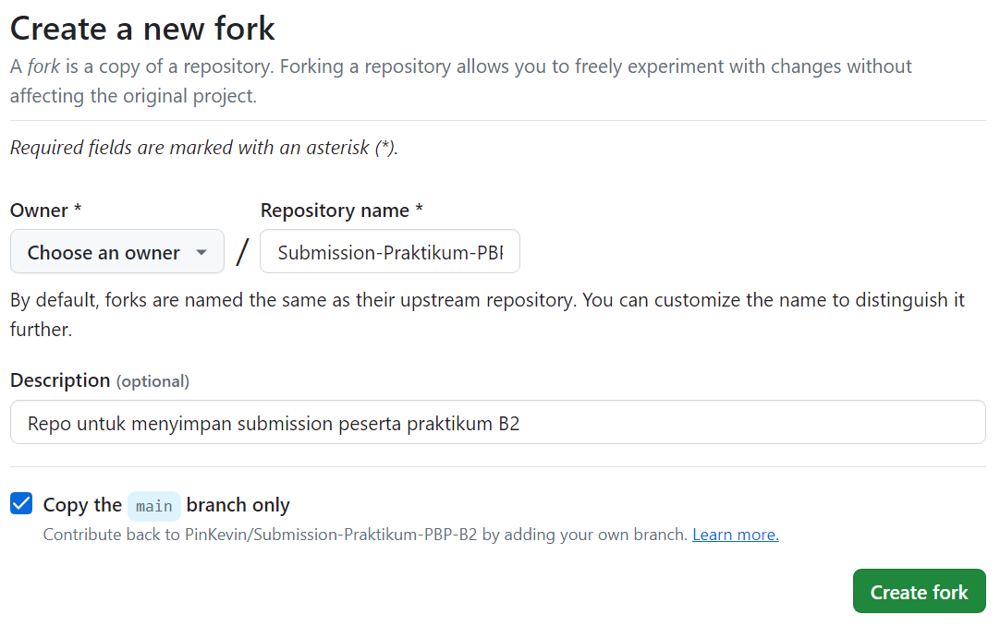
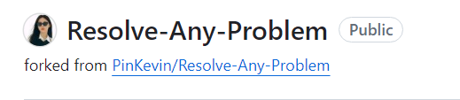
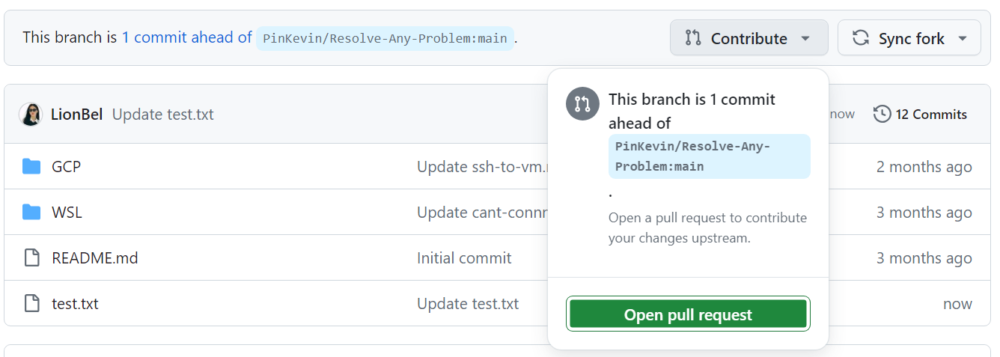
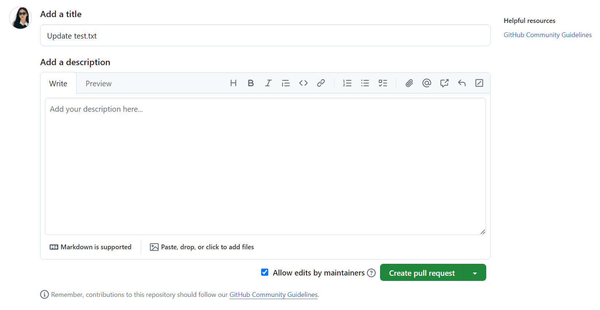
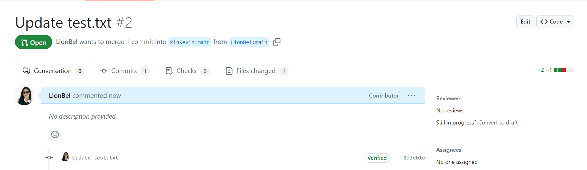

# Submission-Praktikum-PBP-B2
Repo untuk menyimpan submission peserta praktikum B2

## First things first
Untuk bisa mengumpulkan submission, lakukan hal ini dahulu:
1. Fork repo ini, menu tersedia di bagian atas kanan menu kedua dari atas
    

      
    

    
2. Setelah itu, pilih owner (akun kalian sendiri), tetapkan yang lain seperti default, lalu pilih "Create   
   fork"
   

      
    

   
3. Jika berhasil, maka nama repo fork akan bernama sama seperti repo asal dan terdapat tulisan "forked from 
   {sumber}" di bawah nama repo
    

      
    

## Do every week
Untuk mengumpulkan submission, lakukan hal-hal ini:
1. Buka repo hasil fork kalian, lalu masukkan pekerjaan kalian pada folder NIM dan minggu yang sesuai.  
   Misal, tugas **pertemuan 1** oleh NIM **24060122150000**, maka kumpulkan di folder **submission-1** dalam folder **24060122150000**

2. Setelah itu, di atas kode, terdapat menu "Contribute". Pilih "Open pull request"
   

3. Isi title dengan "{nim}-Pertemuan {n}", lalu pilih "Create pull request"
   

4. Pull request berhasil dibuat
   

## Jangan lupa membuat laporan praktikum dan kumpulkan hard-copy-nya pada pertemuan berikutnya.

## SEMANGAT!!! 🔥🔥🔥